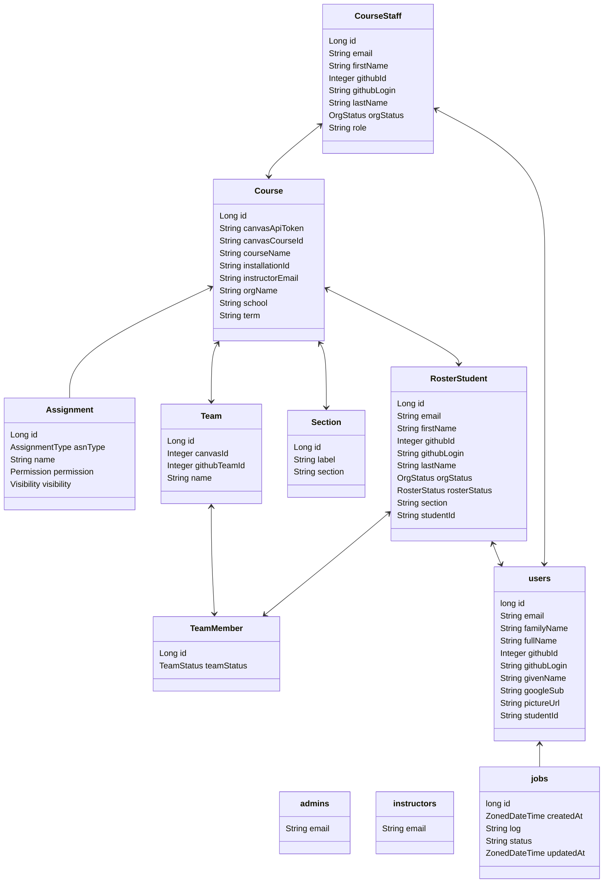

## Lifecycle of Frontiers Entities
In Frontiers, there are several different entities that all interact:
- *User*
- *Course*
- *RosterStudent*
- *CourseStaff*

A *User* is an individual account associated with an individual person. Each person who uses Frontiers should only have 1 account.

A *Course* is an offering of an individual class. One *course* is only used for 1 *term*.

A *RosterStudent* is a single student on the roster of a particular *Course*. Like a *Course*, the lifecycle of a student is for only one term. Each *RosterStudent* is associated with one *User*. However, one *User* can be associated with more than one *RosterStudent*.

A *CourseStaff* is a single staff member on a particular *Course*. Like a *RosterStudent*, it is associated with a single *Course* and a single *User*. They also have a lifecycle of 1 *term*. One *User* may be associated with many *CourseStaff* instances.

## Using Frontiers
An instructor should first create a *Course* through *Swagger*. Then, they should upload their Roster in eGrades format. It will then create the associated Roster Students. Then, they should link their Course to their GitHub Organization, using the url `https://frontiers.dokku-00.cs.ucsb.edu/api/courses/redirect?courseId=<courseId>` where `courseId` is the ID of their course. GitHub will then prompt them for which Organization they'd like to install it to. When they do, they will then be returned to Frontiers.

Then, as students sign into Frontiers and link their GitHubs, their *User* accounts will be automatically linked with their associated Roster Students.

## Database Design

